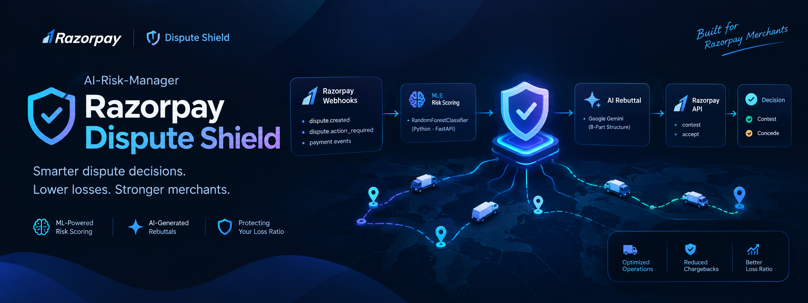

<p align="center">
  
</p>

<p align="center">
  
  
  
  
  
  
  
</p>

# 🛡️ Razorpay Dispute Shield (`AI-Risk-Manager`)

> **Automated payment dispute adjudication, evidence-grounded AI rebuttal generation, and card scheme loss-ratio protection built natively for the Razorpay Merchant Ecosystem.**

---

## ⚡ Overview

When a customer files a chargeback, Razorpay merchants face a critical trade-off:
- **Blindly contesting** wastes investigator time and incurs representment penalty fees ($\approx ₹1,500$ per failed dispute).
- **Blindly conceding** leaks revenue on false or fraudulent claims.
- **Breaching the 1.50% loss ratio ceiling** triggers severe Visa VAMP / Mastercard ECP monitoring fines ($\ge ₹5,00,000$) and risks merchant account suspension.

**Razorpay Dispute Shield** enforces a simple principle: **Decide *whether* to contest before deciding *how* to contest.**

```
Razorpay Webhook Ingestion ──▶ ML Win Probability ──▶ 3-Zone VAMP Triage ──▶ Gemini Rebuttal ──▶ Razorpay Direct Contest
   (dispute.created)           (Random Forest)         (Ratio-Aware Teff)      (8-Part Legal)       (POST /v1/disputes)
```

---

## 🚀 Key Highlights (Zero-Mock Architecture)

- **Native Razorpay Gateway:** Live `/v1/disputes/{id}/contest` and `/v1/disputes/{id}/accept` execution with HMAC-SHA256 webhook signature verification.
- **Calibrated ML Scoring:** `RandomForestClassifier` (FastAPI) scores 11 fulfillment evidence attributes into an objective win probability ($0.00 \le p \le 1.00$).
- **Dynamic VAMP Ratio Protection:** Escalates defense win thresholds ($T_{\text{eff}}$) dynamically as the merchant approaches the 1.50% Card Scheme monitoring ceiling.
- **Evidence-Grounded AI:** Outbound Google Gemini (`gemini-3.6-flash`) generates formal 8-part representment packets backed strictly by verified merchant facts.
- **MySQL Relational Ledger:** Real database on port 3306 with HikariCP connection pooling and immutable audit logging.
- **Modern Cockpit:** React 19 dark-mode UI with dossier inspector, Razorpay service modal, and scheme rules reference.

---

## 🏁 1-Click Quickstart

### Start Everything (Windows)
Double-click or run:
```cmd
run.bat
```
*Auto-detects ports, sets up `.env`, launches Python ML (:5000), boots Spring Boot (:8080), and opens the React UI on `http://localhost:3000`.*

### Start Everything (Linux / macOS)
```bash
chmod +x run.sh
./run.sh
```

### Docker Compose
```bash
docker compose up --build -d
```

---

## ⚙️ Environment Configuration (`.env`)

Configure your credentials in `.env` (template in `.env.example`):

```properties
# Google Gemini AI Studio
GEMINI_API_KEY="your-google-ai-studio-api-key"
LLM_MODEL=gemini-3.6-flash

# MySQL Database
MYSQL_URL=jdbc:mysql://localhost:3306/chargeback_responder?createDatabaseIfNotExist=true&useSSL=false
MYSQL_USERNAME=root
MYSQL_PASSWORD=your_password

# Python ML Microservice
ML_SERVICE_URL=http://localhost:5000

# Razorpay Dispute Gateway (Switch to rzp_live_... for production)
RAZORPAY_KEY_ID=rzp_test_shield2026
RAZORPAY_KEY_SECRET=rzp_sec_shield2026
RAZORPAY_WEBHOOK_SECRET=whsec_rzp_shield2026
```

---

## 📚 Deep-Dive Documentation

For detailed technical references, pitch scripts, and cloud deployment guides:

| Document | Description |
| :--- | :--- |
| 📘 **[Enterprise Operations & Pitch Playbook](doc/ENTERPRISE_SYSTEM_AND_PITCH_GUIDE.md)** | Full system architecture, 5-minute executive pitch script, slide deck structure, and ROI math. |
| 🔑 **[Live Services & Integration Guide](doc/REAL_SERVICES_INTEGRATION_GUIDE.md)** | Step-by-step setup for live Razorpay API keys, webhooks, and Gemini AI credentials. |
| 🚀 **[Production Deployment Guide](DEPLOYMENT.md)** | End-to-end instructions for Docker Compose, AWS EC2, Render, Railway, and Linux VPS. |
| 🧪 **[Testing & QA Manual](doc/TESTER_GUIDE.md)** | Automated test suite execution, API endpoint testing, and boundary case evaluation. |

---

<p align="center">
  <b>Razorpay Dispute Shield</b> · Protecting Merchant Margins & Safeguarding Gateway Standing.
</p>
